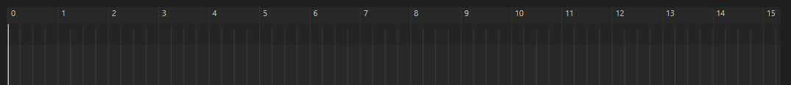
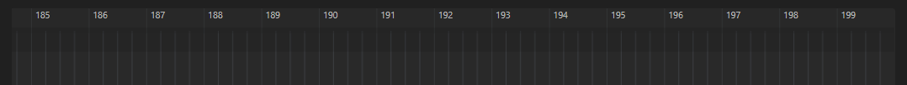

# WEB DAW EXPERIMENTATION

Because there is neither open source nor ready-to-use tools for building DAW-like app on the web, I need to create it myself by doing some experimentation

### To do

- [ ] Learn music theory: time signatures, key signatures, rhythmic notation
- [ ] set of Components for the web (plain DOM and adapter for React)

### Overview

#### Default view

#### Scalable Beat time `Ruler`

#### Configurable beats per measure

_TODO_: This should be calculated from the `time signatures`

##### value 1

.PNG>)

##### value 2

.PNG>)

##### value 3

.PNG>)

##### value 6

.PNG>)
